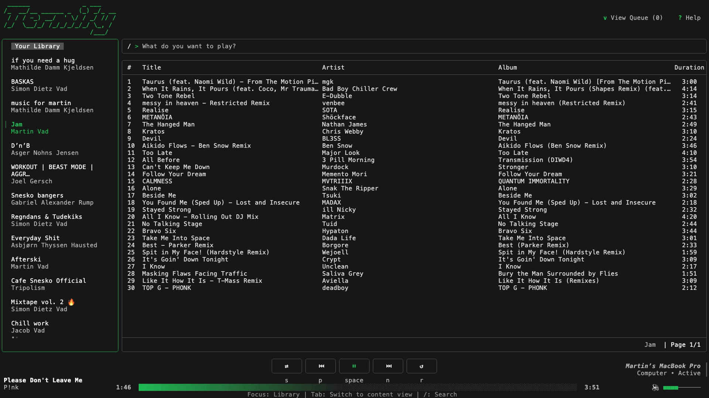

# Termify - Spotify TUI Client

A terminal-based Spotify client written in Go using Bubbletea



### Prerequisites

- A Spotify account (Premium required for full playback functionality)

## Configuration

Termify supports multiple ways to configure the application:

### Configuration File

By default, Termify looks for a configuration file at:

- `~/.config/termify/config.yaml` (macOS/Linux)
- `%APPDATA%\termify\config.yaml` (Windows)

Example configuration file:

```yaml
server:
  port: 8080
spotify:
  client_id: your_spotify_client_id
  connect_client: default
logging:
  enabled: true
```

### Command-line Flags

You can also configure Termify using command-line flags:

```
Usage:
  termify [flags]

Flags:
  --config string           Path to config file
  --port string             Server port
  --client-id string        Spotify client ID
  --connect-client string   Spotify connect client to use
  --logging bool            Enable or disable logging (default: true)
```

### Environment Variables

Termify also supports configuration via environment variables:

- `TERMIFY_PORT`: Server port
- `TERMIFY_CLIENT_ID`: Spotify client ID
- `TERMIFY_CONNECT_CLIENT`: Spotify connect client to use
- `TERMIFY_LOGGING_ENABLED`: Set to "true" or "1" to enable logging, anything else disables it

## Configuration Priority

Termify uses the following priority order for configuration (highest to lowest):

1. Command-line flags
2. Environment variables
3. Configuration file
4. Default values

## Getting Started

1. Get a Spotify Client ID from the [Spotify Developer Dashboard](https://developer.spotify.com/dashboard/applications)
2. Configure Termify with your Client ID using one of the methods above
3. Run Termify and follow the authentication process

### Using Go Install

```bash
go install github.com/dietzy1/termify@latest
```

## Building from Source

```bash
go build -o termify
```

## Contributions

## License

[MIT License](LICENSE)
